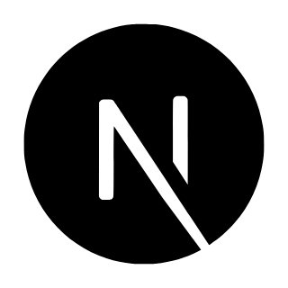

<h1 align="center">Hey  I'm Anuj  Pal</h1>
<h3 align="center">I start with curiosity and scale ideas into production-grade products.</h3>

  

## 🧠 My Focus Areas
- Web Development
- Blockchain

## 📊 GitHub Stats & Trophies

  
  

  

  

## 🛠️ Languages & Tools

<h3 align="center">Programming Languages</h3>

  &nbsp;
  &nbsp;
  &nbsp;
  &nbsp;
  

<h3 align="center">Frontend</h3>

  &nbsp;
  &nbsp;
  &nbsp;
  &nbsp;
  

<h3 align="center">Backend</h3>

  &nbsp;
  

<h3 align="center">Database</h3>

  &nbsp;
  &nbsp;
  

<h3 align="center">DevOps & Cloud</h3>

  &nbsp;
  

<h3 align="center">Tools</h3>

  &nbsp;
  &nbsp;
  &nbsp;
  

 

## 🔗 Connect with Me

  
  
  

## 💬 Quote
> "Focus on problems that cannot be solved today at all."‎ ‎ ‎ ‎ ‎  - Jensen Huang

<picture>
  <source media="(prefers-color-scheme: dark)" srcset="https://raw.githubusercontent.com/abozanona/abozanona/output/pacman-contribution-graph-dark.svg">
  <source media="(prefers-color-scheme: light)" srcset="https://raw.githubusercontent.com/abozanona/abozanona/output/pacman-contribution-graph.svg">
  
</picture>

  

